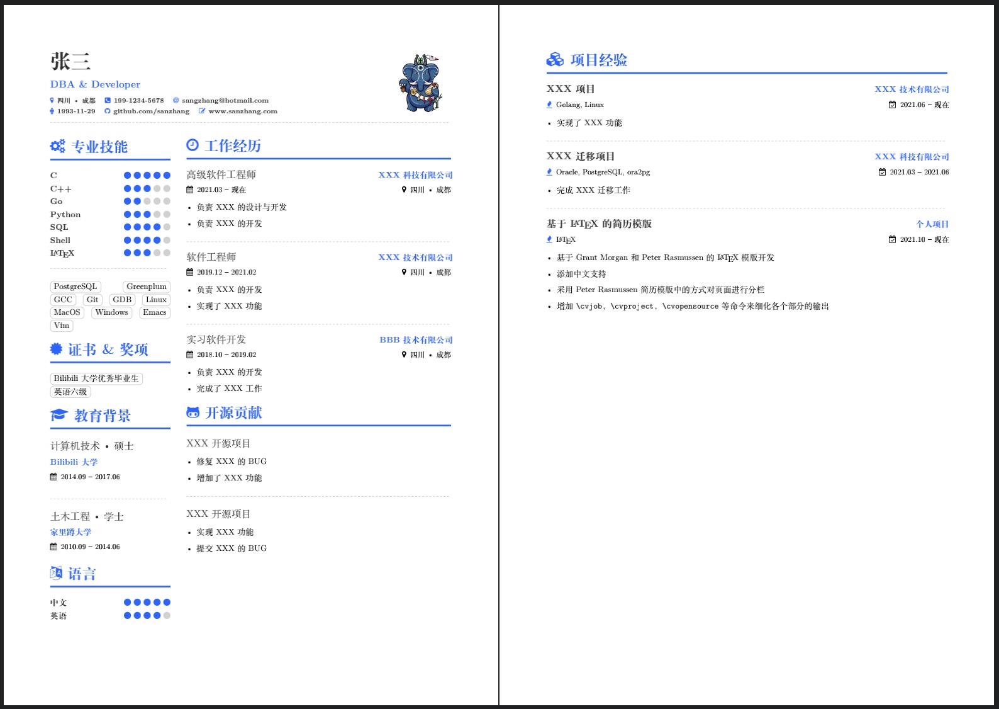

# xresume 简历模版

该模版基于 [Grant Morgan's First LaTeX Resume][1] 和 [Peter Rasmussen's Resume (Data Scientist)][2] 的 LaTeX 模版，做了如下修改：

* 采用 Peter Rasmussen's Resume 中的方式对页面进行分栏，即使用 `minipage` 进行分栏
* 增加了部分命令来细化各个部分的输出，如 `\cvjob`, `\cvproject`，`\cvopensource` 等

## 示例

[1]: https://www.overleaf.com/articles/grant-morgans-first-latex-resume/jtdbtcctgnrr
[2]: https://www.overleaf.com/articles/peter-rasmussens-resume-data-scientist/bphkfprrcnwv
